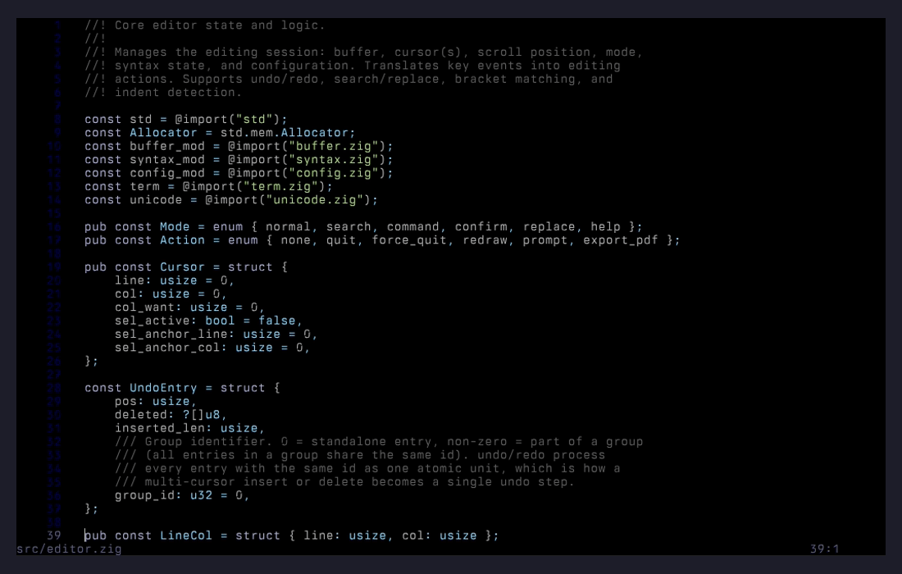
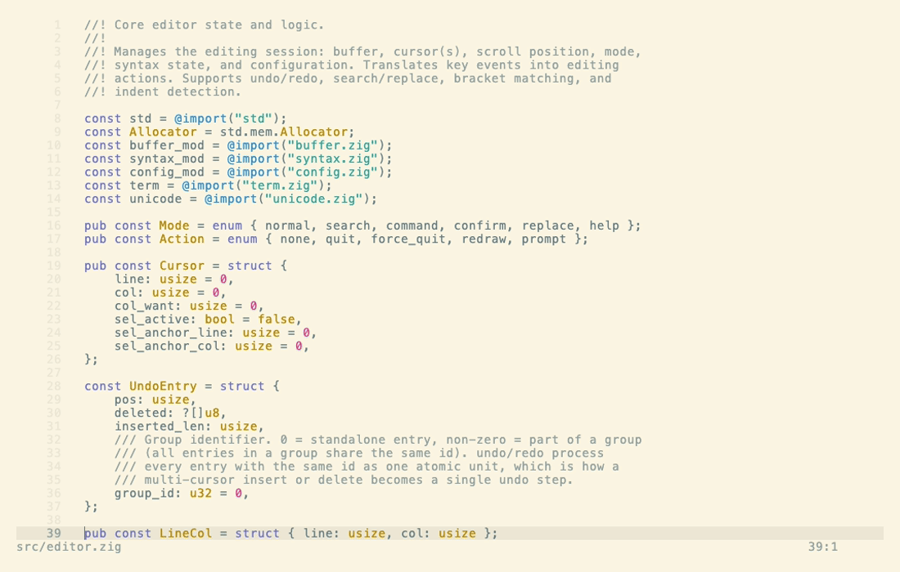
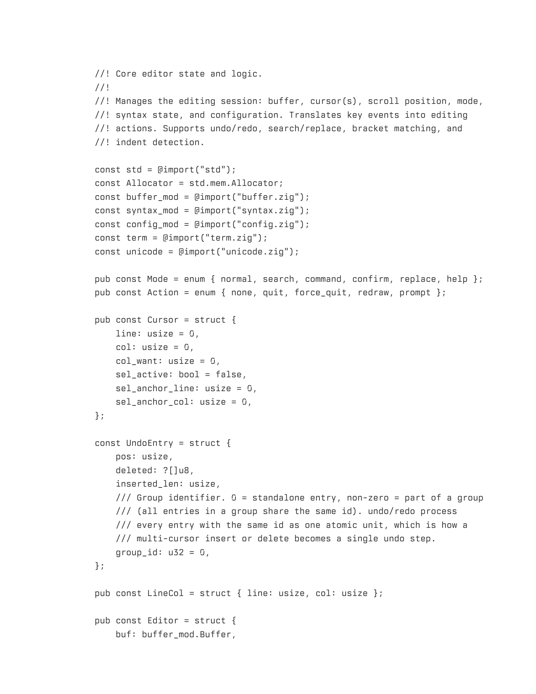
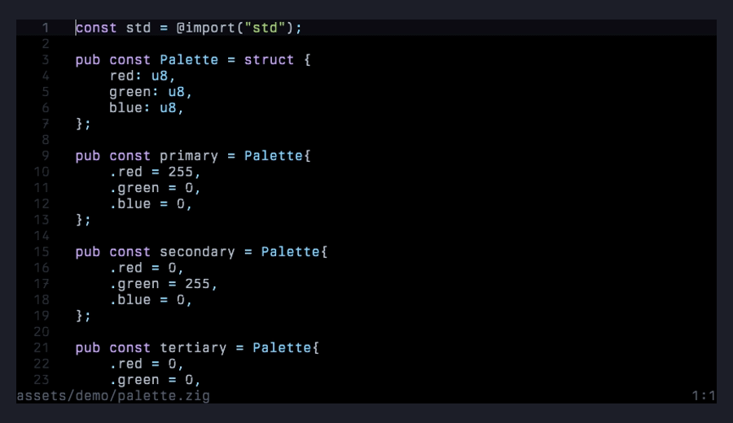
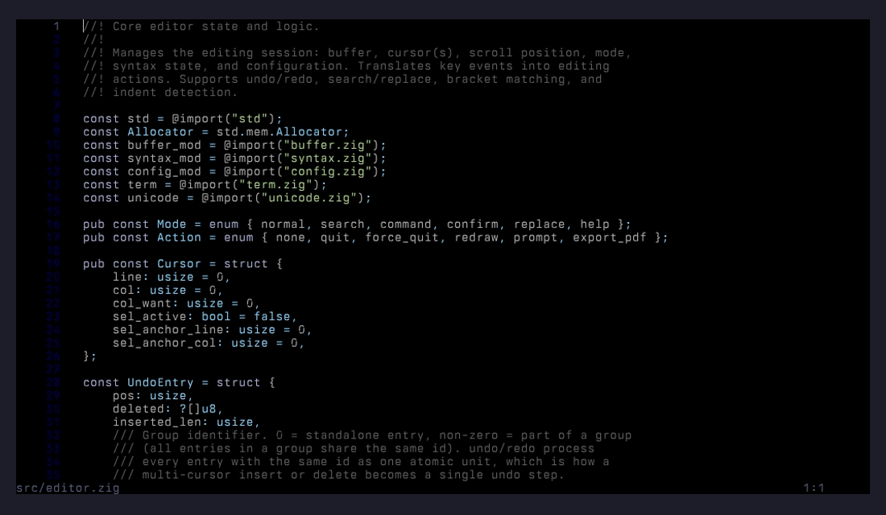
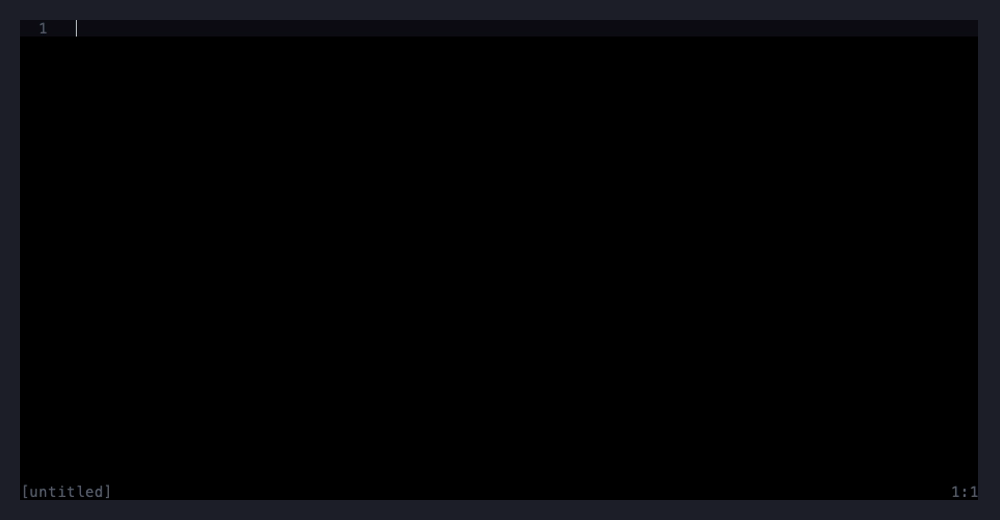

# issy

A text editor that looks like a printed page, not a terminal application.

Built in Zig with zero external dependencies. Single binary, cross-compiles to Linux, macOS, Windows, and OpenBSD. Gap buffer text storage, syntax highlighting for 17 languages (including TeX/LaTeX), PDF export with TTF/OTF font embedding, multiple cursors, undo/redo, and incremental search.

### Two themes: default (dark) and paper (Solarized Light)

Pick the one that matches your environment. Both follow the same design principle — only a couple of token types get real chromatic contrast so the eye parses structure through gentle luminance shifts instead of a rainbow.

| Default | Paper |
|---|---|
|  |  |

### Print to PDF with embedded fonts

`Ctrl+P` (or `--print` on the command line) renders the current buffer to a real PDF 1.4 file with TTF/OTF font embedding, a separate ink-on-paper print theme, headers, and automatic page breaks. No external dependencies, no temporary PostScript — the PDF writer is hand-rolled in Zig.



### Multiple cursors

`Ctrl+D` selects the word under the cursor and adds a cursor at the next occurrence. Press it again to keep adding. Every subsequent edit — typing, backspace, delete, paste — applies to all cursors simultaneously, and `Ctrl+Z` undoes the whole multi-cursor tick as one step.



### Incremental search

`Ctrl+F` enters search mode; each keystroke re-runs the search and jumps the cursor to the first live match. `Ctrl+G` walks to the next match, `Escape` cancels and returns the cursor to where it started.



### Path completion

`Ctrl+O` opens the file prompt seeded with the current directory. Type a partial directory or filename and press `Tab` to auto-complete against what's on disk.



## Install

### Linux

Pre-built binaries from the latest commit on main:

| Platform | Package | Binary |
|----------|---------|--------|
| Linux x64 | [.deb](https://github.com/davidemerson/issy/releases/latest/download/issy_0.1.0-1_amd64.deb) / [.rpm](https://github.com/davidemerson/issy/releases/latest/download/issy-0.1.0-1.x86_64.rpm) | [issy-linux-amd64](https://github.com/davidemerson/issy/releases/latest/download/issy-linux-amd64) |
| Linux ARM64 | [.deb](https://github.com/davidemerson/issy/releases/latest/download/issy_0.1.0-1_arm64.deb) / [.rpm](https://github.com/davidemerson/issy/releases/latest/download/issy-0.1.0-1.aarch64.rpm) | [issy-linux-arm64](https://github.com/davidemerson/issy/releases/latest/download/issy-linux-arm64) |

### macOS

**Homebrew (recommended):**

```sh
brew tap davidemerson/issy https://github.com/davidemerson/issy
brew install --HEAD issy
```

To upgrade: `brew upgrade --fetch-HEAD issy`.

**Build from source** (if you don't use Homebrew):

```sh
git clone https://github.com/davidemerson/issy.git
cd issy
zig build -Doptimize=ReleaseSafe
sudo install -m 0755 zig-out/bin/issy /usr/local/bin/issy
```

Requires [Zig 0.15.2+](https://ziglang.org/download/). Both paths produce a native host-signed binary that runs on both Intel and Apple Silicon without any `xattr`, `codesign`, or quarantine workarounds. Prebuilt macOS binaries are intentionally not shipped because cross-compiled Mach-O from Linux has no code signature and is refused by the Apple Silicon kernel.

### OpenBSD

[Build from source](#build).

## Build

Requires [Zig](https://ziglang.org/) 0.15+.

```sh
zig build                              # debug build
zig build -Doptimize=ReleaseSafe       # release build (~470KB)
zig build test                         # run all tests
```

The binary is placed in `zig-out/bin/issy`.

### Cross-compile

```sh
zig build -Dtarget=x86_64-linux-gnu
zig build -Dtarget=x86_64-macos
zig build -Dtarget=aarch64-macos
zig build -Dtarget=x86_64-windows-gnu
zig build -Dtarget=x86_64-openbsd
```

Or build all cross targets at once:

```sh
zig build cross
```

## Usage

```
issy [options] [file[:line]]
```

Open a file:

```sh
issy main.zig
issy src/editor.zig:42    # open at line 42
issy                      # empty buffer
```

### Options

| Flag | Description |
|------|-------------|
| `--version`, `-v` | Print version and exit |
| `--help`, `-h` | Print usage and exit |
| `--config FILE` | Use a specific config file |
| `--theme NAME` | Override theme (`default`, `paper`) |
| `--font PATH` | TTF/OTF font for PDF output |
| `--no-config` | Skip loading config file |
| `--print FILE` | Export to PDF and exit (no TUI) |
| `--rollback` | Swap in the previous binary (if auto-update has run) and exit |

### Headless PDF export

```sh
issy --font /path/to/font.ttf --print output.pdf source.c
```

## Keybindings

### Editing

| Key | Action |
|-----|--------|
| Ctrl+S | Save |
| Ctrl+Q | Quit (press twice to discard unsaved changes) |
| Ctrl+Z | Undo |
| Ctrl+Y | Redo |
| Ctrl+C | Copy selection |
| Ctrl+X | Cut selection |
| Ctrl+V | Paste |
| Ctrl+A | Select all |
| Tab | Insert tab or spaces (per config) |
| Enter | Newline with auto-indent |

### Navigation

| Key | Action |
|-----|--------|
| Arrow keys | Move cursor |
| Home / End | Start / end of line |
| Page Up / Down | Scroll by page |
| Mouse scroll | Scroll viewport (cursor stays) |
| Mouse click | Position cursor |

### Search and Replace

| Key | Action |
|-----|--------|
| Ctrl+F | Incremental search (Escape cancels, Enter confirms) |
| Ctrl+G | Find next match |
| Ctrl+H | Search and replace (Tab switches fields, Enter replaces next, Ctrl+A replaces all) |

### Files and Buffers

| Key | Action |
|-----|--------|
| Ctrl+O | Open file (prompts for path) |
| Ctrl+N | New empty buffer |
| Ctrl+P | Export to PDF (requires `font_file` in config) |
| Ctrl+R | Reload file from disk |
| Ctrl+W | Same as Ctrl+Q |

### Multiple Cursors

| Key | Action |
|-----|--------|
| Ctrl+D | Select word under cursor; press again to add cursor at next occurrence |
| Escape | Clear all extra cursors and selection |

All editing operations (typing, backspace, delete, paste) apply to every cursor simultaneously.

### Help

| Key | Action |
|-----|--------|
| Ctrl+/ | Show keybindings overlay (any key to dismiss) |
| F1 | Same as Ctrl+/ |

## Configuration

Create `~/.issyrc` (POSIX) or `%APPDATA%\issy\config` (Windows). See [CONFIGURATION.md](CONFIGURATION.md) for the full reference, or copy [examples/issyrc](examples/issyrc) as a starting point.

Quick example:

```
tab_width = 4
expand_tabs = true
line_numbers = true
right_margin = 100
cursor_style = bar
font_file = "/path/to/font.ttf"

[theme.paper]
```

## Themes

**default** -- Black background, restrained. Keywords are violet, strings are soft green, comments are dim. Most syntax colors sit close to the foreground luminance. The cursor line is a barely perceptible band.

**paper** -- Solarized Light. Warm cream background (`#fdf6e3`), muted body text. Violet keywords, cyan strings, yellow types. Designed for readability in bright environments.

Both themes follow the design principle: only 2-3 token types get real chromatic contrast. The eye parses structure through gentle luminance shifts, not a rainbow.

See [DESIGN.md](DESIGN.md) for the full visual design philosophy.

## Syntax Highlighting

C, C++, Zig, Python, JavaScript, TypeScript, Rust, Go, Shell, HTML, CSS, JSON, YAML, TOML, Makefile, Markdown, TeX/LaTeX.

Language is detected by file extension.

## PDF Printing

Requires a TTF or OTF font file set via `font_file` in your config or `--font` on the command line. PDF output uses a separate print theme with colors tuned for ink on white paper -- it never inherits the dark TUI theme.

```sh
# From within the editor: Ctrl+P
# From the command line:
issy --font "Berkeley Mono.ttf" --print output.pdf source.py
```

Recommended fonts: Berkeley Mono, Iosevka, JetBrains Mono, Commit Mono.

## Auto-update

Release builds check for newer versions on startup. The check is a one-shot HTTPS request to the `commit.txt` asset on the latest GitHub release, made by a detached grandchild process so the editor itself never blocks on the network. If the commit SHA on the release differs from the one the running binary was built from, the footer shows `update available: <sha>`.

By default the editor only notifies. To opt into automatic download and in-session apply, set `autoupdate = true` in `~/.issyrc`. With auto-apply on:

1. The background worker downloads `sha256sums.txt` and its Ed25519 signature from the latest release, verifies the signature against the public key embedded in `src/update_key.zig`, then downloads the platform-specific binary and checks it against the signed manifest.
2. The verified binary is written to `~/.cache/issy/issy.staged` and the footer switches to `update staged: <sha>`.
3. The next time the buffer is clean (no unsaved changes) and the editor has been idle for 60 seconds, it writes a small resume record, snapshots the current binary to `~/.cache/issy/issy.prev`, atomically renames the staged binary over its own executable, tears down the terminal, and `execve()`s the new binary with `--resume <path>`. The terminal state survives `execve`, so the visible effect is a single re-render — the open file, the cursor line, even the file mtime check all carry across.
4. If anything goes wrong (non-writable binary, signature mismatch, dirty buffer, failed rename), the editor falls back to notify-only and keeps running the old version.

Dev builds (unreleased working trees) short-circuit the check entirely — only `ReleaseSafe` builds produced by CI participate.

**macOS note.** `autoupdate = true` is silently a no-op on macOS because no prebuilt macOS binaries exist to download. The notify path still works — the footer shows `update available: <sha>` when a newer commit has been published — and macOS users run `brew upgrade --fetch-HEAD issy` (or re-run `zig build -Doptimize=ReleaseSafe`) to actually update.

**Rollback:** after an apply, run `issy --rollback` to swap the previous binary back. It's a one-shot atomic rename with a clear error if there's no snapshot to restore.

**Security model.** The auto-update path trusts only the Ed25519 public key committed to `src/update_key.zig`. The matching private key is held as a GitHub Actions Secret (`UPDATE_SIGNING_KEY`) and only the repo's CI workflow can sign releases. A tampered `sha256sums.txt` or a tampered binary will fail signature verification or hash mismatch, respectively, and staging aborts. The worker runs inside the editor's user, not as root, and refuses to operate on root-owned install paths (e.g. `/usr/bin/issy` from `.deb`/`.rpm` — those installs silently stay in notify-only mode).

**Cache layout.** Everything auto-update related lives under `~/.cache/issy/`:

| File | Contents |
|------|----------|
| `commit.txt` | Latest-release commit SHA (refreshed by the background worker) |
| `sha256sums.txt` / `.sig` | Signed manifest of release binary hashes |
| `issy.staged` | Verified replacement binary waiting to be applied |
| `issy.prev` | Pre-apply snapshot of the running binary (used by `--rollback`) |
| `resume.<ts>.txt` | One-shot cursor snapshot written by `apply()` and consumed by the new instance |

Opt out by setting `notify_updates = false` (disables the check entirely) or leaving `autoupdate = false` (default — only notify, never apply). Both keys live in `~/.issyrc`.

### Signing key bootstrap (maintainers / forks)

If you fork this repo and want auto-update to work for your own release builds, generate your own Ed25519 keypair:

```sh
zig build keygen > /tmp/keys.txt
```

The tool prints a PKCS#8 PEM private key and a Zig array literal for the matching public key. Paste the PEM into a repo secret named `UPDATE_SIGNING_KEY` (Settings → Secrets and variables → Actions), and replace the `public_key` bytes in `src/update_key.zig` with the printed array. Commit that file. On the next push, CI will start signing releases and your users' editors will start verifying them.

The private key never needs to be saved to disk — delete `/tmp/keys.txt` after transferring the two halves.

## Testing

Unit tests (gap buffer, Unicode, tokenizer, etc.):

```sh
zig build test
```

Integration tests (end-to-end via expect, requires `/usr/bin/expect`):

```sh
bash tests/run_tests.sh
```

The integration suite covers 38 tests across file operations, text editing, cursor movement, search/replace, clipboard, quit behavior, and edge cases. Each test launches the real binary in a PTY, sends keystrokes, and verifies outcomes by checking saved file contents.

## Architecture

See [ARCHITECTURE.md](ARCHITECTURE.md) for a tour of the source code.

## Man Page

```sh
man ./issy.1
```

## License

ISC
