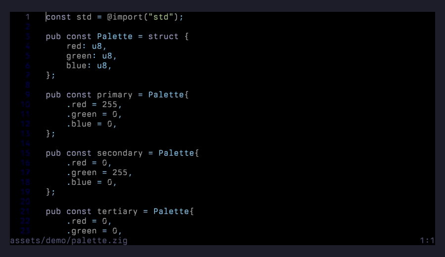

# issy

A text editor that looks like a printed page, not a terminal application.

## Install

```sh
curl -sSL https://raw.githubusercontent.com/davidemerson/issy/main/install.sh | sh
```

**One line.** Drops `issy` at `~/.local/bin/issy`, verifies an Ed25519 signature over the release manifest, seeds `~/.issyrc` with commented defaults if you don't already have one, and wires up the opt-in auto-update path. Works on Linux (amd64/arm64) and OpenBSD amd64 with a prebuilt binary; macOS falls through to a `zig build` from source. [Full install options →](#install-options)

---

## What it looks like

Built in Zig with zero external dependencies. Single binary, around 470KB in `ReleaseSafe`. Gap-buffer text storage, syntax highlighting for 17 languages (including TeX/LaTeX), PDF export with real TTF/OTF font embedding, multi-cursors, undo/redo, incremental search, keyboard and mouse selection.

### Two themes — default (dark) and paper (Solarized Light)

| Default | Paper |
|---|---|
|  |  |

Both follow the same rule: only a couple of token types get real chromatic contrast so the eye parses structure through gentle luminance shifts instead of a rainbow. See [DESIGN.md](DESIGN.md) for the full visual design notes.

### Print to PDF with embedded fonts

`Ctrl+P` renders the current buffer to a real PDF 1.4 file with TTF/OTF font embedding, a separate ink-on-paper print theme, headers, and automatic page breaks. No external dependencies, no temporary PostScript — the PDF writer is hand-rolled in Zig.


### Multi-cursor rename

`Ctrl+D` selects the word under the cursor and adds a cursor at the next occurrence. Press it again to keep adding. Every edit — typing, backspace, delete, paste — applies to all cursors simultaneously, and `Ctrl+Z` undoes the whole multi-cursor tick as a single step.


### Incremental search

`Ctrl+F` enters search mode and each keystroke re-runs the search, jumping the cursor to the first live match. `Ctrl+G` walks to the next match; `Escape` cancels and returns the cursor to where it started.


### Keyboard and mouse selection

Shift + arrow extends a selection one character at a time; `Ctrl+Shift+Left`/`Ctrl+Shift+Right` grow it a word at a time. Click, double-click (select word), and triple-click (select line) also work, as does shift+click to extend from the existing anchor. Drag past the viewport edge and the view autoscrolls.



### Path completion

`Ctrl+O` opens the file prompt seeded with the current directory. Type a partial directory or filename and press `Tab` to complete against what's on disk.


---

## Install options

### Default (one-line curl)

```sh
curl -sSL https://raw.githubusercontent.com/davidemerson/issy/main/install.sh | sh
```

Flags:

| Flag | Default | Purpose |
|---|---|---|
| `--prefix DIR` | `$HOME/.local/bin` | Target install directory |
| `--version VER` | `latest` | Pin to a specific release |
| `--no-rc` | off | Skip seeding `~/.issyrc` |
| `--help`, `-h` | — | Show usage |

Prefer to inspect the script first?

```sh
curl -sSL https://raw.githubusercontent.com/davidemerson/issy/main/install.sh -o install.sh
less install.sh
sh install.sh
```

**How it decides what to do.** On Linux amd64/arm64 and OpenBSD amd64 the installer downloads a prebuilt binary, verifies an Ed25519 signature over `sha256sums.txt` against a public key baked into the script, then verifies the binary's SHA-256 against that manifest, and finally installs with `install -m 0755`. On macOS (and any platform without a prebuilt) it falls through to a source build: clones the repo, runs `zig build -Doptimize=ReleaseSafe`, and installs the resulting binary. Source builds require Zig 0.15.2+ on `PATH`.

### macOS via Homebrew

```sh
brew tap davidemerson/issy https://github.com/davidemerson/issy
brew install --HEAD issy
```

**Upgrade:** `brew upgrade --fetch-HEAD issy`. Plain `brew upgrade` is a no-op for HEAD-only formulas — it only bumps versioned formulas, so without `--fetch-HEAD` you'll keep running whatever you installed first, including its older man page. If you ever see `man issy` showing stale content after an upgrade, force a full rebuild:

```sh
brew uninstall issy && brew install --HEAD issy
```

(`brew reinstall` does not accept `--HEAD`; the uninstall+install pair is the supported way to force a HEAD refresh.)

The curl installer also works on macOS — use whichever you prefer.

### OpenBSD

The curl installer downloads a prebuilt amd64 binary. Builds are verified on every push by a real OpenBSD 7.8 amd64 VM in CI (`openbsd-test` job, see `.github/workflows/ci.yml`) — full unit + integration suite must pass on OpenBSD before main accepts a merge. An `editors/issy` ports submission is in flight; when it lands, `pkg_add issy` will be the preferred path.

Building from source on OpenBSD: `pkg_add zig` then `zig build -Doptimize=ReleaseSafe`. `bash` and `expect` (also via `pkg_add`) are needed if you want to run the integration test suite.

### Build from source

Requires [Zig 0.15.2+](https://ziglang.org/download/).

```sh
git clone https://github.com/davidemerson/issy
cd issy
zig build -Doptimize=ReleaseSafe
install -m 0755 zig-out/bin/issy ~/.local/bin/issy
```

Other `build.zig` entry points:

```sh
zig build                              # debug build
zig build test                         # run all tests
zig build cross                        # build all cross-compile targets
```

Cross-compile targets: `x86_64-linux-gnu`, `aarch64-linux-gnu`, `x86_64-macos`, `aarch64-macos`, `x86_64-openbsd`.

---

## Usage

```
issy [options] [file[:line]]
```

```sh
issy main.zig
issy src/editor.zig:42    # open at line 42
issy newdoc.md            # start a new file at that path
issy                      # empty buffer
```

### Command-line options

| Flag | Description |
|---|---|
| `--version`, `-v` | Print version and exit |
| `--help`, `-h` | Print usage and exit |
| `--config FILE` | Use a specific config file |
| `--theme NAME` | Override theme (`default`, `paper`) |
| `--font PATH` | TTF/OTF font for PDF output |
| `--no-config` | Skip loading config file |
| `--print FILE` | Export to PDF and exit (no TUI) |
| `--rollback` | Swap in the previous binary (if auto-update has run) and exit |

### Headless PDF export

```sh
issy --font /path/to/font.ttf --print output.pdf source.c
```

---

## Keybindings

### Editing

| Key | Action |
|---|---|
| Ctrl+S | Save |
| Ctrl+Q | Quit (on unsaved changes, press Enter or Ctrl+Q again to discard; Escape cancels) |
| Ctrl+Z | Undo |
| Ctrl+Y | Redo |
| Ctrl+C | Copy selection |
| Ctrl+X | Cut selection |
| Ctrl+V | Paste |
| Ctrl+A | Select all |
| Tab | Insert tab or spaces (per config) |
| Enter | Newline with auto-indent |

Typing, Tab, or Enter while a selection is active replaces the selection. Terminal pastes use bracketed paste (DECSET 2004): during a paste, auto-indent is suppressed and tabs land as literal `\t`, so already-indented content comes in verbatim instead of compounding.

### Navigation

| Key | Action |
|---|---|
| Arrow keys | Move cursor |
| Ctrl+Left / Ctrl+Right | Jump by word |
| Home / End | Start / end of line |
| Page Up / Down | Scroll by page |
| Mouse scroll | Scroll viewport (cursor stays) |
| Mouse click | Position cursor |
| Double-click | Select word |
| Triple-click | Select line |

### Selection

| Key | Action |
|---|---|
| Shift + Arrow | Extend selection by character |
| Ctrl+Shift + Left/Right | Extend selection by word |
| Shift + Home / End | Extend to line start / end |
| Shift + Click | Extend selection to click position |
| Click + drag | Extend selection (drag past edge to autoscroll) |
| Escape | Clear selection and extra cursors |

### Search and replace

| Key | Action |
|---|---|
| Ctrl+F | Incremental search (Escape cancels, Enter confirms) |
| Ctrl+G | Find next match |
| Ctrl+H | Search and replace (Tab switches fields, Enter replaces next, Ctrl+A replaces all) |

### Files and buffers

| Key | Action |
|---|---|
| Ctrl+O | Open file (prompts for path) |
| Ctrl+N | New empty buffer (on unsaved changes, prompts for confirmation) |
| Ctrl+P | Export to PDF (requires `font_file` in config or `--font`) |
| Ctrl+R | Reload file from disk |
| Ctrl+W | Same as Ctrl+Q |

### Multi-cursor

| Key | Action |
|---|---|
| Ctrl+D | Select word under cursor; press again to add cursor at next occurrence |
| Escape | Clear all extra cursors and selection |

All editing operations apply to every cursor simultaneously, and `Ctrl+Z` undoes the whole tick.

### Help

| Key | Action |
|---|---|
| Ctrl+/ | Show keybindings overlay |
| F1 | Same as Ctrl+/ |

---

## Configuration

The installer seeds `~/.issyrc` on first run with every setting commented out, so you can see what's available and uncomment what you want. Unknown keys are ignored; missing keys fall back to compiled-in defaults.

See [CONFIGURATION.md](CONFIGURATION.md) for the full reference, or copy [examples/issyrc](examples/issyrc) as a starting point. Quick taste:

```
tab_width = 4
expand_tabs = true
line_numbers = true
right_margin = 100
cursor_style = bar
font_file = "/path/to/font.ttf"

[theme.paper]
```

---

## Syntax highlighting

C, C++, Zig, Python, JavaScript, TypeScript, Rust, Go, Shell, HTML, CSS, JSON, YAML, TOML, Makefile, Markdown, TeX/LaTeX. Language is detected by file extension.

## PDF printing

`Ctrl+P` exports the current buffer to a PDF 1.4 file alongside it (same directory, `.pdf` suffix). `--print output.pdf source.c` does the same headlessly without opening the TUI. Both require a TTF or OTF font file via `font_file` in config or `--font` on the command line. PDF output uses a print theme with colors tuned for ink on white paper — it never inherits the TUI theme.

Recommended fonts: Berkeley Mono, Iosevka, JetBrains Mono, Commit Mono.

---

## Auto-update

Release builds check the latest GitHub release on startup via a detached background worker, so the editor itself never blocks on the network. If the release's commit SHA differs from the one the running binary was built from, the footer shows `update available: <sha>`.

Opt into automatic download and in-session re-exec by setting `autoupdate = true` in `~/.issyrc`. With auto-apply on, the worker downloads the signed manifest, verifies the Ed25519 signature against `src/update_key.zig`, hashes the platform binary against the manifest, stages it at `~/.cache/issy/issy.staged`, and atomically swaps it over the running binary the next time the buffer is clean and the editor has been idle for 60 seconds — then `execve()`s the new binary with a one-shot `--resume` record that restores the cursor position. Rollback any time with `issy --rollback`.

Dev builds skip the check entirely; only `ReleaseSafe` builds produced by CI participate. Root-owned installs silently fall back to notify-only (the worker refuses to overwrite root-owned binaries).

See [ARCHITECTURE.md](ARCHITECTURE.md) for the full flow, the cache layout, and the signing-key bootstrap procedure for forks.

---

## Architecture, testing, man page

- [ARCHITECTURE.md](ARCHITECTURE.md) — tour of the source code and the major subsystems
- `zig build test` — 678-test unit suite (gap buffer, Unicode, tokenizer, editor operations, mouse/selection, etc.)
- `bash tests/run_tests.sh` — end-to-end integration suite via `expect`, launches the real binary in a PTY
- `man ./issy.1` — man page

## License

BSD 3-Clause
