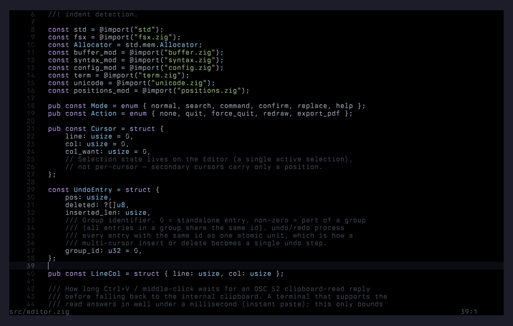
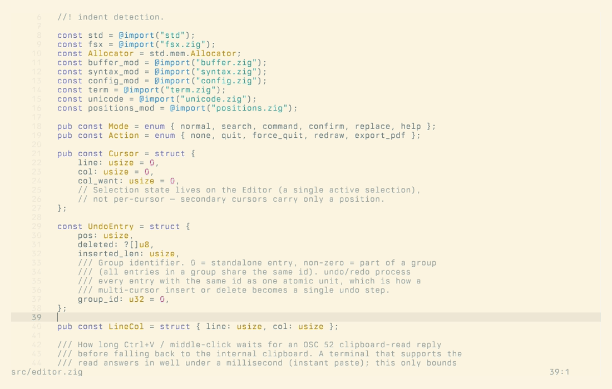
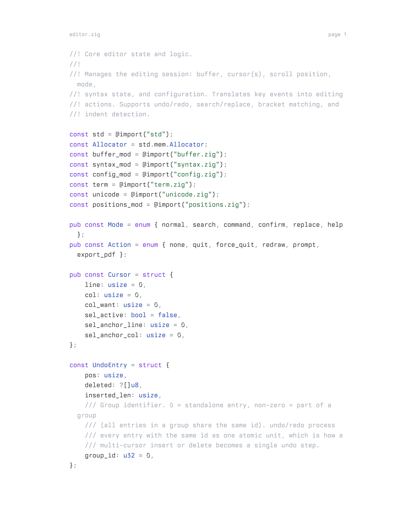
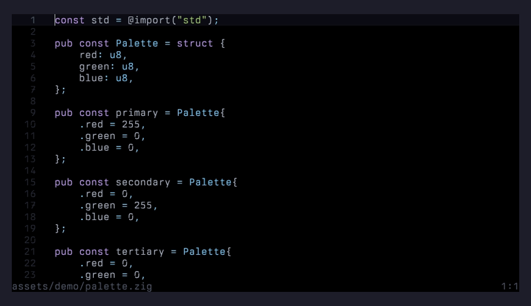
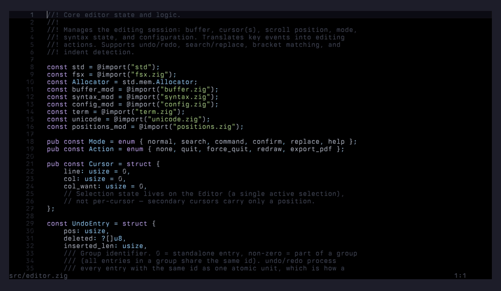
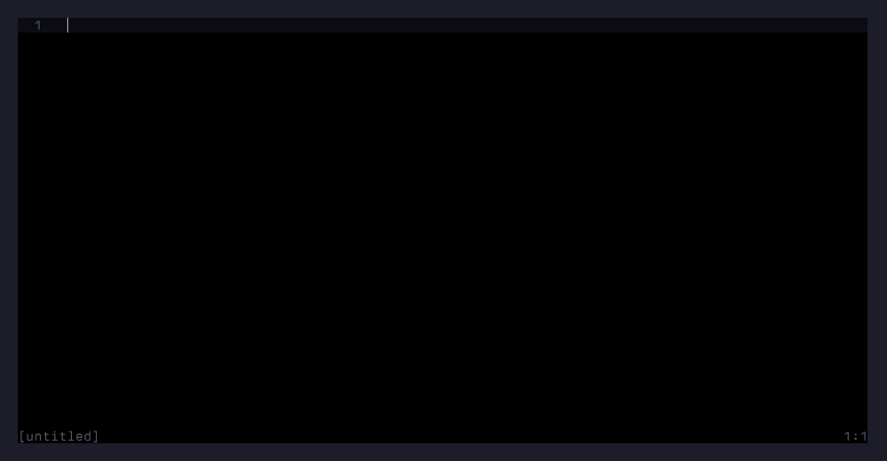

# issy

A text editor that looks like a printed page, not a terminal application.

## Install

```sh
curl -sSL https://raw.githubusercontent.com/davidemerson/issy/main/install.sh | sh
```

**One line.** Drops `issy` at `~/.local/bin/issy`, verifies an Ed25519 signature over the release manifest, seeds `~/.issyrc` with commented defaults if you don't already have one, and wires up the opt-in auto-update path. Works on Linux (amd64/arm64) and OpenBSD amd64 with a prebuilt binary; macOS falls through to a `zig build` from source. [Full install options →](#install-options)

---

## What it looks like

Built in Zig with zero external dependencies. Single binary, around 700KB in `ReleaseSafe`. Gap-buffer text storage with an O(1) line index, syntax highlighting for 20 languages (including TeX/LaTeX), PDF export with real TTF/OTF font embedding and per-token print colors, multi-cursors, undo/redo, incremental search with smart case and live match highlighting, keyboard and mouse selection.

### Two themes — default (dark) and paper (Solarized Light)

| Default | Paper |
|---|---|
|  |  |

Both follow the same rule: keywords and strings carry the strongest chromatic contrast, a few token types get lighter accents, and the rest sit at body-text luminance, so the eye parses structure through gentle shifts instead of a rainbow. See [DESIGN.md](DESIGN.md) for the full visual design notes.

### Print to PDF with embedded fonts

`Ctrl+P` renders the current buffer to a real PDF 1.4 file with TTF/OTF font embedding, per-token syntax colors from a separate ink-on-paper print theme, a filename + page-number header on every page, and automatic page breaks. Text copied out of the PDF extracts as real characters (a proper ToUnicode CMap, not an identity map). No external dependencies, no temporary PostScript — the PDF writer is hand-rolled in Zig.



### Multi-cursor rename

`Ctrl+D` selects the word under the cursor and adds a cursor at the next occurrence. Press it again to keep adding. Every edit — typing, backspace, delete, paste — applies to all cursors simultaneously, and `Ctrl+Z` undoes the whole multi-cursor tick as a single step.



### Incremental search

`Ctrl+F` enters search mode and each keystroke re-runs the search from where you started, jumping the cursor to the first match at or after that origin. Every visible match is highlighted while the prompt is open, and a dim `3/17`-style counter sits after the pattern. All-lowercase patterns match case-insensitively (smart case); any uppercase letter makes the search exact. `Down`/`Ctrl+G` walk to the next match, `Up` walks to the previous one, `Enter` confirms, and `Escape` cancels and returns the cursor to where it started.



### Keyboard and mouse selection

Shift + arrow extends a selection one character at a time; `Ctrl+Shift+Left`/`Ctrl+Shift+Right` grow it a word at a time. Click, double-click (select word), and triple-click (select line) also work, as does shift+click to extend from the existing anchor. Drag past the viewport edge and the view autoscrolls.


### Path completion

`Ctrl+O` opens the file prompt seeded with the current directory. Type a partial directory or filename and press `Tab` to complete against what's on disk.



---

## Install options

### Default (one-line curl)

```sh
curl -sSL https://raw.githubusercontent.com/davidemerson/issy/main/install.sh | sh
```

Flags:

| Flag | Default | Purpose |
|---|---|---|
| `--prefix DIR` | `$HOME/.local/bin` | Target install directory |
| `--version VER` | `latest` | Pin to a specific release |
| `--no-rc` | off | Skip seeding `~/.issyrc` |
| `--help`, `-h` | — | Show usage |

Prefer to inspect the script first?

```sh
curl -sSL https://raw.githubusercontent.com/davidemerson/issy/main/install.sh -o install.sh
less install.sh
sh install.sh
```

**How it decides what to do.** On Linux amd64/arm64 and OpenBSD amd64 the installer downloads a prebuilt binary, verifies an Ed25519 signature over `sha256sums.txt` against a public key baked into the script, then verifies the binary's SHA-256 against that manifest, and finally installs with `install -m 0755`. On macOS (and any platform without a prebuilt) it falls through to a source build: clones the repo, runs `zig build -Doptimize=ReleaseSafe`, and installs the resulting binary. Source builds require Zig 0.15.x or 0.16.x on `PATH` (`src/fsx.zig` bridges the two series' std APIs; anything else is rejected at compile time with an actionable error).

### macOS via Homebrew

```sh
brew tap davidemerson/issy https://github.com/davidemerson/issy
brew install issy
```

**Upgrade:** `brew upgrade issy`. The formula tracks tagged releases (`vX.Y.Z`), so this is the same one-liner you'd use for any Homebrew package — no `--fetch-HEAD`, no uninstall+reinstall dance. CI maintains the formula's `url` + `sha256` automatically on every tag push (see `.github/workflows/ci.yml` → `release-tag` job).

Want the bleeding edge between releases?

```sh
brew install --HEAD issy     # build from main
brew upgrade --fetch-HEAD issy
```

The curl installer also works on macOS — use whichever you prefer.

### OpenBSD

The curl installer downloads a prebuilt amd64 binary. Builds are verified on every push by a real OpenBSD 7.9 amd64 VM in CI (`openbsd-test` job, see `.github/workflows/ci.yml`) — full unit + integration suite must pass on OpenBSD before main accepts a merge. An `editors/issy` ports submission is in flight; when it lands, `pkg_add issy` will be the preferred path.

Building from source on OpenBSD: `pkg_add zig` then `zig build -Doptimize=ReleaseSafe`. `bash` and `expect` (also via `pkg_add`) are needed if you want to run the integration test suite.

### Build from source

Requires [Zig 0.15.x or 0.16.x](https://ziglang.org/download/) (CI exercises 0.15.2 and 0.16.0).

```sh
git clone https://github.com/davidemerson/issy
cd issy
zig build -Doptimize=ReleaseSafe
install -m 0755 zig-out/bin/issy ~/.local/bin/issy
```

Other `build.zig` entry points:

```sh
zig build                              # debug build
zig build test                         # run all tests
zig build cross                        # build all cross-compile targets
```

Cross-compile targets: `x86_64-linux-gnu`, `aarch64-linux-gnu`, `x86_64-macos`, `aarch64-macos`, `x86_64-openbsd`.

---

## Usage

```
issy [options] [file[:line]]
```

```sh
issy main.zig
issy src/editor.zig:42    # open at line 42 (works for new files too: issy draft.md:5 creates draft.md)
issy newdoc.md            # start a new file at that path
issy                      # empty buffer
```

### Command-line options

| Flag | Description |
|---|---|
| `--version`, `-v` | Print version and exit |
| `--help`, `-h` | Print usage and exit |
| `--config FILE` | Use a specific config file |
| `--theme NAME` | Override theme (`default`, `paper`) |
| `--font PATH` | TTF/OTF font for PDF output |
| `--no-config` | Skip loading config file |
| `--print FILE` | Export to PDF and exit (no TUI) |
| `--rollback` | Swap in the previous binary (if auto-update has run) and exit |

### Headless PDF export

```sh
issy --font /path/to/font.ttf --print output.pdf source.c
```

---

## Keybindings

### Editing

| Key | Action |
|---|---|
| Ctrl+S | Save — works from every mode: search/replace/help save and return to normal, the unsaved-changes prompt saves and stays, and the Save-As prompt submits |
| Ctrl+Q | Quit (on unsaved changes: Enter or Ctrl+Q again discards, Ctrl+S saves and stays, Escape cancels) |
| Ctrl+Z | Undo (typing runs coalesce within 500ms — one step per word) |
| Ctrl+Y | Redo |
| Ctrl+C | Copy selection (also pushes to OS clipboard via OSC 52) |
| Ctrl+X | Cut selection (also pushes to OS clipboard via OSC 52) |
| Ctrl+V | Paste the system clipboard via OSC 52 (falls back to issy's internal clipboard if the terminal blocks OSC 52 read) |
| Ctrl+A | Select all |
| Tab | Insert tab or spaces (per config) |
| Enter | Newline with auto-indent |

Typing, Tab, or Enter while a selection is active replaces the selection.

**Pasting.** `Ctrl+V` reads the system clipboard over OSC 52, so text copied in any other application pastes straight in; if the terminal has OSC 52 read disabled (common over SSH), it falls back to issy's own internal clipboard. Middle-click pastes the primary selection the same way. Your terminal's native paste keys always work too — **`Ctrl+Shift+V`** (clipboard) and **`Shift+Insert`** (primary selection) — arriving as a bracketed paste (DECSET 2004). However it arrives, pasted text is inserted verbatim as a single undo step: auto-indent is not applied and embedded newlines or tabs never trigger editor commands, so already-formatted content comes in exactly as copied. Set `system_clipboard = false` in `~/.issyrc` to keep `Ctrl+V` bound to the internal clipboard only.

### Navigation

| Key | Action |
|---|---|
| Arrow keys | Move cursor |
| Ctrl+Left / Ctrl+Right | Jump by word |
| Home / End | Start / end of line |
| Page Up / Down | Scroll by page |
| Ctrl+L | Go to line (prompt for a line number) |
| Mouse scroll | Scroll viewport (cursor stays) |
| Mouse click | Position cursor |
| Double-click | Select word |
| Triple-click | Select line |

### Selection

| Key | Action |
|---|---|
| Shift + Arrow | Extend selection by character |
| Ctrl+Shift + Left/Right | Extend selection by word |
| Shift + Home / End | Extend to line start / end |
| Shift + Click | Extend selection to click position |
| Click + drag | Extend selection (drag past edge to autoscroll) |
| Escape | Clear selection and extra cursors |

### Search and replace

| Key | Action |
|---|---|
| Ctrl+F | Incremental search (Escape cancels, Enter confirms) |
| Up / Down (in search) | Previous / next match |
| Ctrl+G | Find next match |
| Ctrl+H | Search and replace (Tab switches fields, Enter replaces next, Ctrl+A replaces all — one undo step) |

Search is smart-case: all-lowercase patterns match case-insensitively, any uppercase letter makes the match exact. While the search prompt is open, every visible match is highlighted (the one at the cursor is underlined) and a `current/total` counter is shown after the pattern; `Tab` toggles whole-word matching (shown as `[w]`). Each keystroke re-runs the search from the position where you pressed Ctrl+F.

### Files and buffers

| Key | Action |
|---|---|
| Ctrl+O | Open file (on unsaved changes, prompts for confirmation) |
| Ctrl+N | New empty buffer (on unsaved changes, prompts for confirmation) |
| Ctrl+P | Export to PDF (requires `font_file` in config or `--font`) |
| Ctrl+R | Reload file from disk (on unsaved changes, prompts for confirmation) |
| Ctrl+W | Same as Ctrl+Q |

If the open file changes on disk (a `git pull`, another editor), the status bar shows `File changed on disk. Ctrl+R to reload.` — even while issy is idle. Opening, reloading, or starting a new buffer clears the undo history, since it refers to the previous content.

While a buffer has unsaved changes, issy periodically writes them to a sibling `.<name>.swp` file (removed on save or clean exit); if you reopen a file and a leftover swap from a crashed session is found, the status bar points you to it. Turn this off with `swap_files = false`. Optional editing aids off by default: `auto_close_brackets` (type `(` to get `()` with the cursor between, wrap a selection, step over closers, delete empty pairs) and `wrap_indent` (soft-wrap continuation rows hang under the line's own indentation).

### Multi-cursor

| Key | Action |
|---|---|
| Ctrl+D | Select word under cursor; press again to add cursor at next occurrence |
| Escape | Clear all extra cursors and selection |

All editing operations apply to every cursor simultaneously, and `Ctrl+Z` undoes the whole tick.

### Help

| Key | Action |
|---|---|
| Ctrl+/ | Show keybindings overlay |
| F1 | Same as Ctrl+/ |

---

## Configuration

The installer seeds `~/.issyrc` on first run with every setting commented out, so you can see what's available and uncomment what you want. Unknown keys are ignored; missing keys fall back to compiled-in defaults.

See [CONFIGURATION.md](CONFIGURATION.md) for the full reference, or copy [examples/issyrc](examples/issyrc) as a starting point. Quick taste:

```
tab_width = 4
expand_tabs = true
line_numbers = true
right_margin = 100
cursor_style = bar
font_file = "/path/to/font.ttf"

[theme.paper]
```

---

## Per-file cursor memory

Quit a file and issy remembers the cursor position at `~/.cache/issy/positions.txt`; reopening the same file restores the caret automatically. Positions are keyed by absolute path, capped at 300 entries with an LRU-ish "newest on top" layout, and lose gracefully (corrupt file or missing HOME is a silent no-op). Explicit `file:line` on the command line always wins over the saved position.

## Syntax highlighting

C, C++, Zig, Python, JavaScript, TypeScript, Rust, Go, Ruby, Java, Shell, HTML, CSS, JSON, YAML, TOML, Makefile, Dockerfile, Markdown, TeX/LaTeX. Language is detected by file extension or well-known filename (`Makefile`, `Dockerfile`, `Gemfile`, shell dotfiles like `.bashrc`). Multi-line constructs carry across lines — C block comments, Python triple-quoted strings, JS/TS template literals, and Zig `\\` line strings all highlight correctly, including when their opening delimiter is scrolled off-screen.

## Line endings

Files whose lines all end in CRLF are normalized to LF in memory and written back with CRLF on save, so Windows-authored files round-trip byte-for-byte without showing stray carriage returns. Files with mixed endings are left untouched.

## PDF printing

`Ctrl+P` exports the current buffer to a PDF 1.4 file alongside it (same directory, `.pdf` suffix). `--print output.pdf source.c` does the same headlessly without opening the TUI. Both require a TTF or OTF font file via `font_file` in config or `--font` on the command line. PDF output uses a print theme with per-token syntax colors tuned for ink on white paper — it never inherits the TUI theme — and each page carries a filename + page-number header when the top margin has room for one.

Recommended fonts: Berkeley Mono, Iosevka, JetBrains Mono, Commit Mono.

---

## Auto-update

Release builds check the latest GitHub release on startup via a detached background worker, so the editor itself never blocks on the network. If that release is *newer* than the running binary — compared by the commit timestamp both carry, not merely by a differing SHA — the footer shows `update available: <sha>`.

Opt into automatic download and in-session re-exec by setting `autoupdate = true` in `~/.issyrc`. With auto-apply on, the worker downloads the signed manifest, verifies the Ed25519 signature against `src/update_key.zig`, checks the manifest's embedded commit and monotonic epoch (so a replayed older release — authentic but stale — is rejected as a downgrade), hashes the platform binary against the manifest, and stages it at `~/.cache/issy/issy.staged`. The next time the buffer is clean and the editor has been idle for 60 seconds, the staged binary is re-verified against the cached signed manifest — including a check that the release it names is strictly newer than the running build, so an authentic but older staged binary can never be installed as a downgrade — then atomically swapped over the running binary (falling back to a copy-and-rename inside the target directory when the cache is on a different filesystem), and `execve()`d with a one-shot `--resume` record that restores the cursor position. Rollback any time with `issy --rollback` (the snapshot's recorded checksum is verified first).

Dev builds skip the check entirely; only `ReleaseSafe` builds produced by CI participate. When the binary isn't writable by you — the usual case for a root-owned or distro-packaged install — the worker stays in notify-only mode: it refreshes the release check but downloads nothing and never attempts an apply, so there is no wasted bandwidth and no recurring failure notice.

See [ARCHITECTURE.md](ARCHITECTURE.md) for the full flow, the cache layout, and the signing-key bootstrap procedure for forks.

---

## Architecture, testing, man page

- [ARCHITECTURE.md](ARCHITECTURE.md) — tour of the source code and the major subsystems
- `zig build test` — 258-test unit suite (gap buffer, Unicode, tokenizer, editor operations, mouse/selection, search, auto-close, swap files, update verification, hostile-input hardening, etc.); each source file compiles and runs as its own test unit, so imported modules' tests re-run per unit
- `bash tests/run_tests.sh` — end-to-end integration suite via `expect`, launches the real binary in a PTY
- `man ./issy.1` — man page

## License

BSD 3-Clause
